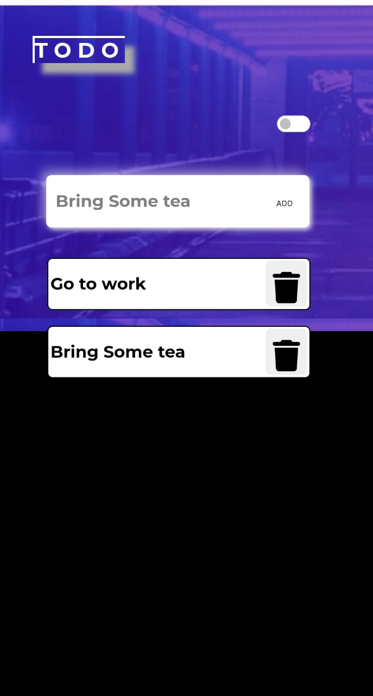

# Todo App

A simple todo application built using HTML, CSS, and JavaScript. This app allows users to create, manage, and track their tasks easily.

## Demo

You can check out the live demo of the Todo App [here](https://s21sd.github.io/TODO-APP/).

## Features

- Create new tasks.
- Edit task details or update task status.
- Delete tasks individually or clear all completed tasks.
- Store tasks locally using browser's localStorage.
